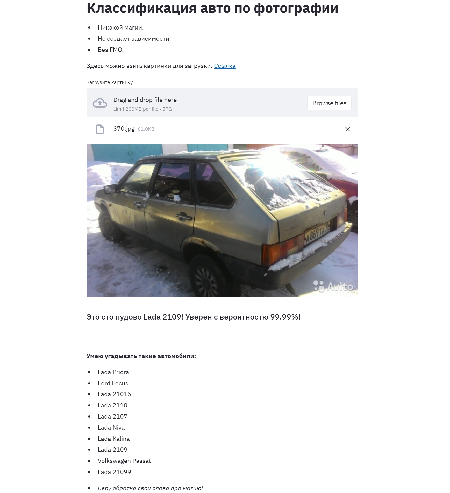

# SF Unit 8: Ford vs Ferrari (Car classification).
## Цель проекта: Классификация автомобилей по фотографиям.
- Соревнование на платформе Kaggle.
- Дан тренировочный датасет с фотографиями автомобилей, разделенный на 10 классов.
- Дан тестовый датасет с фотографиями для определения классов автомобилей.

## Этапы проекта:
- Построить модель на основе предобученной сети Xception, в соответствии с примером baseline.
- Применить файн тюнинг к базовой модели.
- Применить функцию EarlyStopping в блоке Callbacks чтобы не ждать все итерации, когда модель перестала обучаться.
- Потестировать параметры аугментации.
- Применить продвинутую библиотеку аугментации Аlbuminations.
- Потестировать различные варианты Batch нормализации и Dropout нормализации.
- Потестировать другую предобученную имиджнет модель.
- Применить Test Time Augmentation (TTA).

## Реализация проекта
### Этап 1: Построить модель на основе предобученной сети Xception, в соответствии с примером baseline.
- Ноутбук по этапу: 
- Построил модель.
- Разобрался с принципом работы.

**Предварительные выводы:**
- Получил первые предсказания модели.
- Accuracy на тесте: 91.07%.
- Accuracy Kaggle: 92.254%.

### Этап 2: Transfer learning с fine-tuning + Callbacks.
- Ноутбук по этапу: 
- Добавил EarlyStopping в блок Callbacks чтобы не ждать все итерации, когда модель перестала обучаться.
- Заморозим веса базовой модели, обучим голову отдельно и будем частично размораживать слои базовой сети и дообучать.
- Будем постепенно уменьшать learning rate и увеличивать количество эпох обучения.

**Предварительные выводы:**
- Модель сразу переобучилась, но итоговый показатель улучшился. Продолжим оптимизацию алгоритма.
- Увеличение количества эпох обучения дало эффект только до 11-ти.
- Добавление остановки в функции Callback позволило с одной стороны увеличить количество эпох обучения, с другой сократило общее время работы скрипта, отсечением лишних эпох обучения.
- Accuracy на тесте: 92.92%.
- Accuracy Kaggle: 93.483%.

### Этап 3: Тестируем варианты аугментации, batch и dropout нормализации + настройка GPU.
- Ноутбук по этапу: 
- В процессе тестирования большого количества вариантов аугментации, а также комбинаций batch и dropout нормализации на Google colab, сервис перестал предоставлять ресурс GPU из-за большой активности.
- Пришлось разобораться с оптимизацией расчетов на GPU домашнего ПК, распределением памяти и процессов между CPU и GPU компьютера.
- Протестированы различные варианты аугментации.
- Протестированы различные комбинации batch и dropout нормализации.

**Предварительные выводы:**
- Установлена библиотека Tensorflow 2.4 с поддержкой GPU в базе.
- Компьютер настроен для работы, как с GPU, так и с CPU с возможностью распределения ресуросов системы в коде ноутбука.
- Времся обучения на 1 эпоху сократилось с 1:20 часов до 7:30 минут.
- Влияние аугментации дало прирост метрики.
- Комбинации batch и dropout нормализации существенного положительного влияния пока не оказали (можно потестировать позднее).
- Accuracy на тесте: 93.65%.
- Accuracy Kaggle: 95.101%.

### Этап 4: Тестируем модель FixEfficientNetB7 с базовыми настройками.
- Ноутбук по этапу: 
- Заменим базовую модель с Xception на FixEfficientNetB7.
- Тестируем с параметрами аугментации, полученными в прошлом эксперименте.
- Тестируем пока без файн тюнинга, сначала разберемся самой моделью.

**Предварительные выводы:**
- Разобрался с настройкой и запуском базовой модели.
- Модель с базовыми настройками отработала хуже Xception.
- Модель существенно более требовательна к вычислительным ресурсам и памяти.
- Все расчеты пришлось делать на CPU, т. к. GPU не хватало памяти. Существенное уменьшение batch size помогло запустить GPU, однако сильно возрасло количество шагов в эпохе обучения, что сделало расчет на CPU более выгодным из-за хорошего объема оперативной памяти компьютера.
- Accuracy на тесте: 83.73%.
- Accuracy Kaggle: 85.84%.

### Этап 5-8: Тестируем продвинутую аугментацию. Библиотека Albuminations.
### Продолжение тестирования batch и dropout нормализации.
### Тестируем различные комбинации полносвязных слоев и количества нейронов.
- Ноутбук по этапу: 
- Вернулся к базовой модели Xception без файн тюнинга на GPU, как к самой быстро работающей, для того, чтобы можно было сделать много экспериментов с параметрами аугментации.
- Устанавливаем и разбираемся с настройкой продвинутой библиотеки аугментации Albuminations.
- Пробуем различные варианты параметров.
- Пробуем различные варианты комбинаций batch и dropout нормализации.
- Пробуем различные варианты комбинаций полносвязных слоев и количества нейронов.

**Предварительные выводы:**
- Разобрался с параметрами аугментации. Выбрал оптимальные из всех экспериментов.
- Закончил тестирование комбинаций batch и dropout нормализации, выбрал оптимальную комбинацию.
- Протестировал различные комбинации полносвязных слоев и количества нейронов.
- Значение метрик на данном этапе нерелевантно, т. к. для ускорения процесса не применялся файн тюнинг.

## Итоговые ноутбуки
### Этап 9: Доведем модель на базе Xception до максимальных показателей.
- Ноутбук по этапу: 
- На основе предыдущих тестов, доведем модель до Xception до максимальных показателей.
- Применим оптимальные полученные комбинации аугментации, batch и dropout нормализации.
- Применим оптимальные полученные комбинации аугментации.
- Применим файн тюнинг.
- Уменьшим степень аугментации в конце обучения.
- Добавим Test Time Augmentation (TTA).

**Итог работы:**
- Окончательная точность предсказания модели до 97.23%.

### Этап 10: Повторим этап 9 с базовой моделью FixEfficientNetB0.
- Ноутбук по этапу: 
- Заменим модель Xception на FixEfficientNetB0 и проделаем все операции по достижению максимальных показателей метрики.

**Итог работы:**
- Окончательная точность предсказания модели до 97.23%.

## Web-сервис по классификации авто
- Создан веб-сервис по классификации авто.
- Архитектура сервиса:
    - Docker-контейнер с моделью.
    - Docker-контейнер с веб-оболочкой.
    - Очередь Rabbitmq
- Алгоритм работы:
    - Веб-оболочка формирует начальное описание сервиса, форму для загрузки файла, футер.
    - Загруженный файл преобразуется в numpy-массив, далее в json и передается в очередь.
    - Сервис с моделью получает данные из очереди, делает предсказание класса и отправляет его в другую очередь.
    - Веб-сервис получает предсказание класса и выводит его на экран с комментариями.
- Загружаем картинку, получаем ответ, какая модель авто изображена на картинке.

**Вывод по данному этапу**
- На локальном ПК отпрабатывает хорошо, с достингнутой точностью предсказаний.
- На сервере Digital Ocean запускается, но практически не работает из-за недостатка оперативной памяти и мощности процессора.
- По картинкам не автомобилей (любых предметов), с разной долей уверенности предсказывает, что это за автомобиль.

## Выводы по проекту:
- Создана базовая модель на примере baseline ноутбука.
- Протестировал различные комбинации слоев dropout и batch нормализации.
- Протестировал различные комбинации полносвязных слоев и количество нейронов в слоях.
- Протестировал различные параметры аугментации.
- Протестировал влияние значения learnin rate на качество обучения модели.
- Применил callbacks функцию для сохранения лучших параметров модели и остановки обучения, когда модель перестает обучаться.
- Протестировал влияние количества эпох обучения на качество обучения модели.
- Разобрался с распределением ресурсов ПК между CPU с оперативной памятью и GPU. Существенно улучшил производительность процесса.
- Протестировал имиджнет-модели - Xception, FixEfficientNetB7, FixEfficientNetB0.
- Применил файн тюнинг при обучении модели.
- Добавил Test Time Augmentation (TTA).
- Увеличил точность предсказания модели до 97.243%.
- Сделал web-сервис, предсказывающий модель авто по загружаемому изображению.

